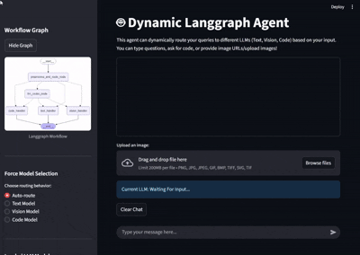

# AgenticAI LangGraph Streamlit App

A multi-modal conversational agent built with [LangGraph](https://github.com/langchain-ai/langgraph), [LangChain](https://github.com/langchain-ai/langchain), and [Streamlit](https://streamlit.io/). This app routes user queries to specialized LLMs for text, code, or vision (image) tasks, and supports both image uploads and URLs.

---

## Demo




Or download and watch:  
[DynamicLanggraphAgentDemo.mp4](DynamicLanggraphAgentDemo.mp4)

---

## Features

- **Dynamic Routing:** Automatically detects if your query is text, code, or image and routes it to the appropriate model.
- **Image Support:** Upload images or provide image URLs (local or web) for vision-based queries.
- **Interactive Web UI:** Powered by Streamlit for a modern chat experience.
- **Workflow Visualization:** View the LangGraph workflow graph in the sidebar.
- **Clear Chat:** Easily reset your conversation and state.
- **Robust Error Handling:** User-friendly error messages and safe state resets if something goes wrong.
- **UI State Management:** Chat history, model hints, and file uploaders are all managed for a smooth user experience.

---

## Requirements

- Python 3.13+
- [Ollama](https://ollama.com/) (for running LLMs locally)
- [Graphviz](https://graphviz.gitlab.io/download/) (for workflow visualization)
- All Python dependencies in `requirements.txt`

---

## Setup

1. **Clone the repository:**
    ```sh
    git clone <your-repo-url>
    cd AgenticAI_langgraph
    ```
2. **Create and activate a virtual environment:**
    ```sh
    python -m venv venv
    # On Windows:
    .\venv\Scripts\activate
    # On macOS/Linux:
    source venv/bin/activate
    ```

3. **Install dependencies inside the virtual environment:**
    ```sh
    pip install -r requirements.txt
    ```

4. **Install Graphviz:**
    - **Windows:** Download and install from [Graphviz website](https://graphviz.gitlab.io/download/).
    - **macOS:** `brew install graphviz`
    - **Linux:** `sudo apt-get install graphviz`

5. **Download Ollama models:**
    ```sh
    ollama pull llama3.2
    ollama pull gemma3
    ollama pull qwen2.5-coder:7b
    ```

6. **Run the Streamlit app:**
    ```sh
    streamlit run app.py
    ```

---

## Usage

- **Text queries:**  
  `What is the capital of France?`
- **Code queries:**  
  `Write a Python function to reverse a string.`
- **Local image:**  
  `Describe this image: C:\Users\YourUser\Pictures\my_image.png`
- **Web image:**  
  `What's in this picture? https://example.com/image.jpg`
- **Image upload:**  
  Use the file uploader in the UI.

Type your message in the chat input or upload an image. The agent will respond accordingly.

---

## File Structure

- `app.py` — Main Streamlit app for the conversational agent.  
  Includes robust error handling, chat clearing, and UI state management for a seamless user experience.
- `langgraph_agent.py` — Contains the LangGraph workflow and agent logic, including routing and model selection.
- `test_agent.py` — Unit and integration tests for the agent logic and workflow.
- `requirements.txt` — Python dependencies.
- `step_by_step_building/` — Contains incremental scripts and notebooks demonstrating the development process, experiments, and prototypes for building the final agentic workflow.
- Other `.py` and `.ipynb` files — Additional experiments, utilities, or earlier versions.

---

## Running Tests

To run the test cases, make sure your virtual environment is activated, then type:
```sh
python test_agent.py
```

---

## License

This project is licensed under the MIT License.