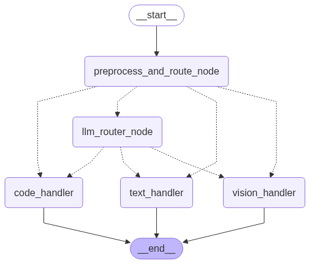

# AgenticAI LangGraph Streamlit App

A dynamic, multimodal AI agent using [LangGraph](https://github.com/langchain-ai/langgraph), integrated with a user-friendly Streamlit web interface. The agent can intelligently route user queries to specialized Large Language Models (LLMs) for text generation, code assistance, or image understanding.

**Demo hardware:**  
_This application is run on a laptop with an Intel i7 7th Gen CPU, NVIDIA RTX 3060TI GPU, and 16GB RAM._

---

## Demo


Or download and watch:  
[DynamicLanggraphAgentDemo.mp4](DynamicLanggraphAgentDemo.mp4)

---

## Workflow

The following diagram illustrates the internal workflow of the app, showing how user queries are routed and processed by different nodes in the LangGraph agentic workflow:



- **User Input:** The user submits a text, code, or image query via the Streamlit UI.
- **Routing Node:** The agent analyzes the input and determines whether it should be handled by a text, code, or vision model.
- **Specialized Node:** The query is sent to the appropriate model (LLM for text/code, vision model for images).
- **Response Node:** The agent collects the model’s response and sends it back to the user interface.
- **State Management:** The workflow maintains conversation history, handles errors, and manages UI state for a seamless experience.

---

## Features

- **Multimodal Input:** Accepts text queries, direct image uploads, and image URLs (both web and local file paths).
- **Dynamic LLM Routing:**
  - **Automated Routing:** Intelligently identifies the intent of the user's query (text, vision, or code) and routes it to the most appropriate specialized LLM.
  - **LLM-Driven Classification:** For automated routing, the `llm_router_node` uses the `llama3.2` text model to classify the user's query. It constructs a specific prompt asking `llama3.2` to determine if the query primarily requires a 'text', 'vision', or 'code' model, and to respond with only one word. This decision then guides the LangGraph workflow to the correct specialized handler.
  - **Forced Routing:** Allows users to explicitly select a specific LLM (Text, Vision, or Code) to bypass automatic routing for a given turn.
- **LLMs:** Leverages different Ollama models for distinct tasks:
  - `llama3.2:3b` for general text and routing decisions.
  - `gemma3:4b`  for image understanding.
  - `qwen2.5-coder:7b` for code-related queries.
- **Interactive Streamlit UI:** Provides a chat-like interface for seamless interaction.
- **Real-time Feedback:** Displays the currently active LLM, loading indicators, and informative messages.
- **Image Display:** Shows uploaded or linked images directly in the chat history.
- **Workflow Visualization:** Displays the LangGraph workflow graph in the sidebar for transparency.
- **Clear Chat:** Easily reset your conversation and state.
- **Robust Error Handling:** User-friendly error messages and safe state resets if something goes wrong.
- **UI State Management:** Chat history, model hints, and file uploaders are all managed for a smooth user experience.
- **Modular Codebase:** Organized into multiple Python files for better readability, reusability, and extensibility.

---

## Project Structure

```
my_agent_project/
├── app.py                # Main Streamlit application file (UI, chat, session state, graph display)
├── langgraph_agent.py    # Core LangGraph agent workflow, node definitions, model initialization
├── test_agent.py         # Unit/integration tests for the LangGraph agent
├── requirements.txt      # Python dependencies
├── DynamicLanggraphAgentDemo.gif
├── DynamicLanggraphAgentDemo.mp4
├── langgraph_workflow.png
└── step_by_step_building/ # Incremental scripts and notebooks for development and experiments
```

- **app.py:** Handles the web UI, user input (text, file uploads), displays chat history, manages Streamlit's session state, imports and orchestrates the LangGraph agent logic, and displays the workflow graph and loaded LLM models in the sidebar.
- **langgraph_agent.py:** Defines the core LangGraph agent workflow, initializes Ollama LLM models, defines all LangGraph nodes (text, vision, code, routing, preprocessing), and compiles the StateGraph.
- **test_agent.py:** Contains unit/integration test cases for the LangGraph agent, importing the compiled graph for automated tests (no Streamlit UI involved).
- **step_by_step_building/**: Contains incremental scripts and notebooks demonstrating the development process, experiments, and prototypes for building the final agentic workflow.

---

## Setup

### Prerequisites

- **Python 3.9+**
- **Ollama:** Download and install from [ollama.com](https://ollama.com/). Ensure the Ollama server is running in the background.
- **Graphviz:** Required for workflow visualization.

### Installation Steps

1. **Clone the repository:**
    ```sh
    git clone <your-repo-url>
    cd my_agent_project
    ```

2. **Create and activate a virtual environment (recommended):**
    ```sh
    python -m venv venv_agent
    # On Windows:
    .\venv_agent\Scripts\activate
    # On macOS/Linux:
    source venv_agent/bin/activate
    ```

3. **Install Python dependencies:**
    ```sh
    pip install -r requirements.txt
    ```

4. **Install Graphviz (system-level software):**
    - **macOS:** `brew install graphviz`
    - **Ubuntu/Debian:**  
      ```sh
      sudo apt-get update
      sudo apt-get install graphviz
      ```
    - **Windows:**  
      Download and run the installer from [Graphviz Download Page](https://graphviz.org/download/).  
      **Important:** During installation, select "Add Graphviz to the system PATH for all users." If you skip this, manually add the Graphviz `bin` directory to your system's PATH.

5. **Download Ollama models:**
    ```sh
    ollama pull llama3.2
    ollama pull gemma3
    ollama pull qwen2.5-coder:7b
    ```

---

## Running the Application

Activate your virtual environment if not already active, then run:

```sh
streamlit run app.py
```

This will open the application in your default web browser (usually at http://localhost:8501).

---

## Running Tests

To run the test cases, make sure your virtual environment is activated, then type:

```sh
python test_agent.py
```

This will execute the predefined test scenarios and print their results to the console.

---

## Usage in Streamlit

- **Text Queries:** Type your questions directly into the chat input box.
- **Image Uploads:** Use the "Upload an image:" file uploader. After uploading, type your query related to the image in the text input and press Enter.
- **Image Links:** Paste web image URLs (e.g., `https://example.com/image.jpg`) or local file paths (e.g., `C:\Users\YourUser\Pictures\my_image.png`) directly into the chat input along with your query.
- **Model Selection:** Use the "Force Model Selection" radio buttons in the sidebar to manually choose which LLM handles the next query (bypassing the router). Select "Auto-route" to let the agent decide.
- **Clear Chat:** Click the "Clear Chat" button to reset the conversation.
- **Workflow Graph:** The LangGraph workflow graph is displayed in the sidebar by default. Click "Hide Graph" to toggle its visibility.
- **Loaded LLM Models:** Below the graph, you'll see a list of the specific Ollama models currently loaded and used by the application.

---

## Extensibility

- **Add New LLM Models/Capabilities:** Introduce new ChatOllama instances and integrate them into `langgraph_agent.py`.
- **Modify Routing Logic:** Adjust the router or preprocessing nodes in `langgraph_agent.py` to refine how queries are categorized.
- **Add New Nodes:** Implement additional processing steps (e.g., tool-use, summarization) in `langgraph_agent.py`.
- **Enhance UI:** Customize `app.py` with more Streamlit widgets, styling, or interactive elements.
- **Develop More Tests:** Add comprehensive test cases in `test_agent.py` to ensure new features work as expected.

---

## License

This project is licensed under the MIT License.
